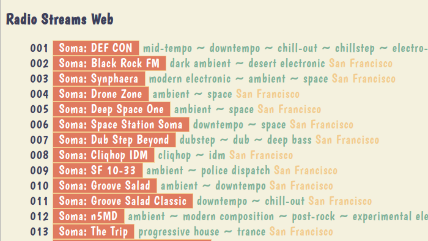

# radio_streams_web
## Serve radio station links

### Included software:

- Python 3
- CherryPy
- Jinja 2
- JSON database



## Run App

```zsh
$ python3 index.py
[03/Nov/2021:09:50:51] ENGINE Listening for SIGTERM.
[03/Nov/2021:09:50:51] ENGINE Listening for SIGHUP.
[03/Nov/2021:09:50:51] ENGINE Listening for SIGUSR1.
[03/Nov/2021:09:50:51] ENGINE Bus STARTING
CherryPy Checker:
The Application mounted at '' has an empty config.

[03/Nov/2021:09:50:51] ENGINE Started monitor thread 'Autoreloader'.
[03/Nov/2021:09:50:51] ENGINE Serving on http://127.0.0.1:8080
[03/Nov/2021:09:50:51] ENGINE Bus STARTED
```

CherryPy engine is then serving on [http://127.0.0.1:8080](http://127.0.0.1:8080).

## Import Modules

```python
from json import load
import os
import cherrypy
from jinja2 import Environment, FileSystemLoader
```

### CherryPy

>CherryPy is an object-oriented web application framework using the Python programming language. It is designed for rapid development of web applications by wrapping the HTTP protocol but stays at a low level and does not offer much more than what is defined in RFC 7231.&mdash;[Wikipedia: CherryPy](https://en.wikipedia.org/wiki/CherryPy)

### Jinja

>Instances of [the `Environment`] class are used to store the configuration and global objects, and are used to load templates from the file system or other locations.

>[FileSystemLoader class] Loads templates from the file system. This [builtin] loader can find templates in folders on the file system and is the preferred way to load them.
>
>The loader takes the path to the templates as string...:&mdash;[jinja2.FileSystemLoader](https://jinja2docs.readthedocs.io/en/stable/api.html#jinja2.FileSystemLoader), [builtin-loaders](https://svn.python.org/projects/external/Jinja-1.1/docs/build/loaders.html#builtin-loaders)

```python
loader=FileSystemLoader(f'{WORKING_DIR}/templates')
```

### JSON encoder and decoder

>[json.load deserializes] ...to a Python object using [a] conversion table.&mdash;[json.load](https://docs.python.org/3/library/json.html#json.load)

### Decorator

Class methods called by CherryPy in response to client requests are said to be _exposed_, which helps describe the `@cherrypy.expose()` decorator used to modify the `index(self)` class method.

## Class

The `Index()` class has two class methods:

```python
class Index():
    @cherrypy.expose()
    def index(self):
        template = e.get_template(f'index.html')
        return template.render(station_data=self.station_data())

    def station_data(self):
        with open(f'{WORKING_DIR}/json/stations.json') as json_file:
            return load(json_file)
```

The class method `index(self)` returns the rendered Jinja template, including the deserialized JSON data returned by the `station_data()` class method.

### If Statement

CherryPy's `quickstart()` method takes `Index()` and starts the app if it is ran as a standalone:

```python
if __name__ == '__main__':
    cherrypy.quickstart(Index())
```

## Format Loop Index

`loop.index` was used to enumerate the station list.

Below are a couple of examples of how each successive 3-digit `loop.index` value could be padded with zeros using `format()` method:

```
{{ '%03d' % loop.index }}
{{ '{:03}'.format(loop.index) }}
```
